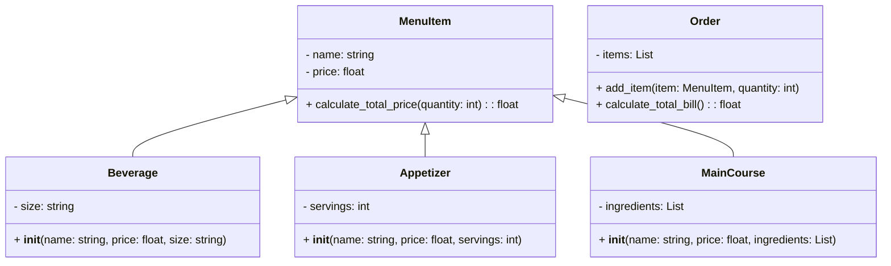

#Reto_3_POO
**Diagrama de clases de restaurante**

```mermaid
classDiagram
    class MenuItem {
        - name: string
        - price: float
        + calculate_total_price(quantity: int): float
    }

    class Beverage {
        - size: string
        + __init__(name: string, price: float, size: string)
    }

    class Appetizer {
        - servings: int
        + __init__(name: string, price: float, servings: int)
    }

    class MainCourse {
        - ingredients: List<string>
        + __init__(name: string, price: float, ingredients: List<string>)
    }

    class Order {
        - items: List<Tuple>
        + add_item(item: MenuItem, quantity: int)
        + calculate_total_bill(): float
    }

    MenuItem <|-- Beverage
    MenuItem <|-- Appetizer
    MenuItem <|-- MainCourse
```
